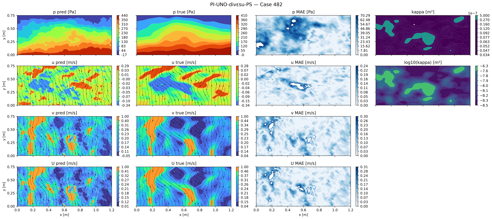
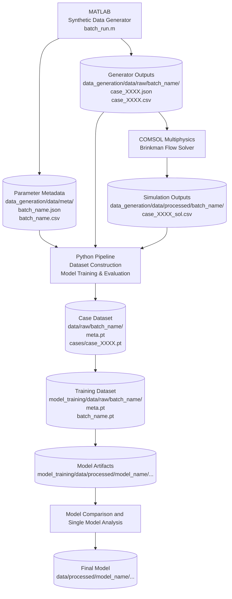
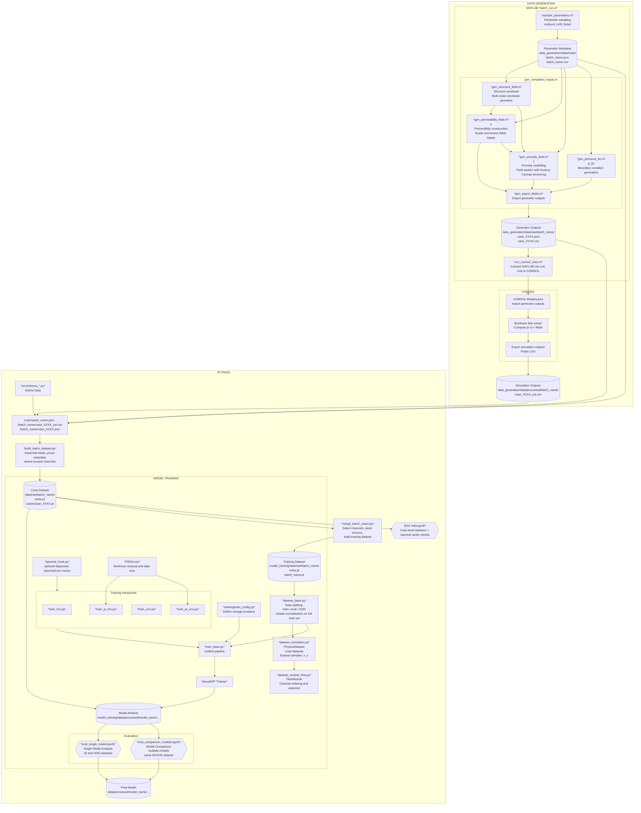

# GrainLegumes-PINOs: Physics-Informed Neural Operators for Porous Media Flow  
### *Specialization Project (VP1) – MSE Data Science, Autumn 2025*

**Master of Science in Engineering – Major Data Science**  
**Eastern Switzerland University of Applied Sciences (OST)**  
**Author:** Rino M. Albertin  
**Supervisor:** Prof. Dr. Christoph Würsch  

---

## 📌 Project Overview

This specialization project studies the learning of physically consistent surrogate models for incompressible air flow in **porous granular media** using **Physics-Informed Neural Operators (PINOs)**.

High-fidelity permeability and porosity fields are synthetically generated in **MATLAB** and simulated with **COMSOL Multiphysics** using a Darcy–Brinkman formulation.  
The central objective is to train two-dimensional neural operators that learn the operator mapping

  **(κ, ε, p_bc) → (p, u, v)**

from spatially varying permeability tensors κ, porosity fields ε, and inlet pressure boundary conditions p_bc to pressure and velocity fields, while explicitly enforcing physical consistency through PDE-based constraints.

The repository provides a complete, modular research pipeline covering:

<details>
<summary><strong>🧩 Data generation  </strong></summary>

A fully automated MATLAB-driven pipeline for synthetic porous-media data generation, including:
- **Parameter sampling**: space-filling sampling strategies (uniform, LHS, Sobol)
- **Structure synthesis**: stochastic multi-scale structure field generation as latent geometric backbone
- **Permeability construction**: physically consistent mapping to scalar and tensor-valued permeability fields
- **Porosity modelling**: independent porosity field generation with global Kozeny–Carman level anchoring
- **Boundary conditions**: low-dimensional, spatially varying inlet pressure boundary conditions
- **High-fidelity simulation**: batch-controlled Darcy–Brinkman simulations in COMSOL via LiveLink for MATLAB
The pipeline supports resume-safe batch execution, reproducible seeding, and rich data export (CSV + JSON).
</details>


<details>
<summary><strong>📊 Exploratory Data Analysis (EDA)</strong></summary>

An interactive EDA framework including:
- **Statistical analysis**: case-level distributions of generator parameters, meta statistics, and reduced field statistics (min/mean/max)
- **Spectral analysis**: two-dimensional FFT-based analysis
- **Scale diagnostics**: isotropic radial energy spectra and vertical spectral evolution analysis
</details>


<details>
<summary><strong>⚙️ Neural Operator training (FNO / U-NO / PINOs)  </strong></summary>

A modular, reproducible training framework for neural operator models, including:
- **Architectures**: FNO, U-NO, and physics-informed variants (PI-FNO, PI-U-NO)
- **Multi-field I/O**: spatial coordinates, tensor-valued permeability, porosity, inlet pressure → velocity components and pressure
- **Physics-informed learning**: COMSOL-consistent Brinkman PINO loss combining data fidelity and PDE residuals
- **Spectral diagnostics**: optional non-intrusive forward hooks on spectral convolution layers
- **Experiment tracking**: structured logging with full model, optimizer, scheduler, and loss configurations (wandb + checkpoints)
- **Hyperparameter optimization**: systematic Optuna-based search across architectural, training and physics-informed loss parameters with staged training
</details>


<details>
<summary><strong>🧪 Evaluation</strong></summary>

A evaluation suite for systematic model comparison and assessment, supporting both cross-model comparison on fixed datasets and cross-dataset generalisation analysis (ID and OOD), including:
- **Global error analysis**: L2 and relative L2 metrics, distributions, CDFs, mean and standard-deviation error maps, and frequency-domain error spectra
- **Error decomposition**: error vs output magnitude and error vs distance to domain boundaries
- **Physical consistency checks**: velocity divergence, mass conservation error maps, pressure boundary-condition consistency, and full Darcy–Brinkman operator residual evaluation
- **Error sensitivity analysis**: parameter–error correlation heatmaps and parameter-wise error trend analysis
- **Interactive sample inspection**: multi-field prediction, ground truth, and error viewer with permeability field visualisation
- **Outlier and extreme-case analysis**: worst-case per output channel and extreme input parameter multi-field case viewer
</details>


🧬 **Interactive research environment**  
All evaluation components are provided as interactive Jupyter widgets with dataset selection, case sliders and dynamic plots for systematic exploration of model behaviour.

---

## 📄 Project Report

Full project report, including methodology, model formulation, and detailed evaluation results:
[Albertin_2026_PINO_Airflow_PorousMedia.pdf](docs/Albertin_2026_PINO_Airflow_PorousMedia.pdf)

---

## 📊 Visualization

<p align="center">
  
</p>

<p align="center">
<em>
Evaluation of the best-performing model (PI-U-NO with physics-informed loss) on a challenging outlier case.  
The model accurately reconstructs pressure and velocity fields, maintaining low error and physically consistent flow patterns even under highly heterogeneous and non-trivial permeability configurations.
</em>
</p>

---

## 🧭 Data Flow Overview

<details>
<summary><strong>High-Level System Overview (Tools and Data Flow)</strong></summary>


</details>

<details>
<summary><strong>Detailed Pipeline Architecture (Data Generation, Training, Evaluation)</strong></summary>


</details>

---

## ⚙️ Local Execution

<details>
<summary><strong>Option A – Run in Visual Studio Code with Docker Dev Container (recommended)</strong></summary>

**Requirements**
- [Docker Desktop](https://www.docker.com/products/docker-desktop)
- [Visual Studio Code](https://code.visualstudio.com/)
- VS Code extension **“Dev Containers”**

**Steps**
```bash
git clone https://github.com/Rinovative/grainlegumes-pino.git
cd grainlegumes-pino
```
1. Open the folder in VS Code  
2. Reopen in Container (via prompt or `F1 → Dev Containers: Reopen in Container`)  
3. Launch one of the notebooks or trainingsskripts  

</details>

<details>
<summary><strong>Option B – Run via Docker CLI (without VS Code)</strong></summary>

```bash
git clone https://github.com/Rinovative/grainlegumes-pino.git
cd grainlegumes-pino

docker build -t pino-dev .
docker run -it --rm -p 8888:8888 -v $(pwd):/app pino-dev
jupyter notebook --ip=0.0.0.0 --no-browser --allow-root
```

Then open the URL shown in the terminal.

</details>

---

## 📂 Repository Structure
<details>
<summary><strong>Show project tree</strong></summary>

```bash
.
│
├── data                                                              # Central storage for datasets used in training and evaluation
│   ├── meta                                                          # Global metadata
│   │
│   ├── processed                                                     # Final Model
│   │
│   └── raw                                                           # Raw simulation outputs
│       ├── lhs_var80_seed3001                                        # Example dataset batch (Latin Hypercube Sampling)
│       │   ├── cases                                                 # Individual simulation cases
│       │   │   ├── case_0001.pt                                      # PyTorch case containing fields (kappa, p, u, v)
│       │   │   └── case_0002.pt                                      # Additional simulation case
│       │   └── meta.pt                                               # Batch-level generation metadata
│       └── ...                                                       # Additional raw datasets
│
├── data_generation                                                   # Full data generation pipeline (MATLAB → COMSOL → Python)
│   ├── comsol                                                        # COMSOL-related assets
│   │   └── template_brinkman.mph                                     # COMSOL Darcy-Brinkman model template
│   │
│   ├── data                                                          # Intermediate and final generation outputs
│   │   ├── meta                                                      # Dataset generation metadata
│   │   │   ├── lhs_var80_seed3001.csv                                # Case-level generator parameters
│   │   │   ├── lhs_var80_seed3001.json                               # Batch-level configuration metadata
│   │   │   └── ...                                                   
│   │   │
│   │   ├── processed                                                 # Processed COMSOL solution fields
│   │   │   ├── lhs_var80_seed3001                                    # Processed batch outputs
│   │   │   │   ├── case_0001_sol.csv                                 # Processed solution for case 0001
│   │   │   │   └── case_0002_sol.csv                                 # Processed solution for case 0002
│   │   │   └── ...                                                   
│   │   │
│   │   └── raw                                                       # Raw MATLAB-generated fields
│   │       ├── lhs_var80_seed3001                                    # Raw permeability batch
│   │       │   ├── case_0001.csv                                     # Raw field data (e.g. kappa(x,y))
│   │       │   └── case_0001.json                                    # Case-specific metadata
│   │       └── ...                                                   
│   │
│   └── matlab                                                        # MATLAB code for field generation and COMSOL coupling
│       ├── functions                                                 # Modular MATLAB function library
│       │   ├── core                                                  # Core generation and simulation logic
│       │   │   ├── gen                                               # Low-level physical field generators
│       │   │   │   ├── gen_export.m                                  # Export routines for CSV and COMSOL
│       │   │   │   ├── gen_permeability_field.m                      # Synthetic permeability field generator
│       │   │   │   ├── gen_porosity_field.m                          # Porosity field generator
│       │   │   │   ├── gen_pressure_bc.m                             # Pressure boundary condition generator
│       │   │   │   └── gen_structure_field.m                         # Structure and obstacle field generator
│       │   │   │
│       │   │   ├── gen_simulation_inputs.m                           # Assembly of COMSOL simulation inputs
│       │   │   ├── run_comsol_case.m                                 # Execution of a single COMSOL simulation
│       │   │   ├── sample_parameters.m                               # Design of experiments and parameter sampling
│       │   │   └── visualize_case.m                                  # MATLAB visualization utilities
│       │   │
│       │   └── test                                                  # MATLAB tests
│       │       └── ...
│       │
│       ├── batch_run.m                                               # Full batch execution script
│       ├── build_batch_dataset.py                                    # Python converter from raw outputs to PyTorch datasets
│       ├── merge_batch_cases.py                                      # Merge individual cases into unified datasets
│       ├── permeability_field_viewer.mlx                             # MATLAB live script for field inspection
│       └── single_run.m                                              # Single-case debug execution
│
├── model_training                                                    # Training, evaluation, and analysis
│   ├── data                                                          # Training-related data storage
│   │   ├── meta                                                      # Training-related metadata
│   │   │
│   │   ├── processed                                                 # Model runs and evaluation artefacts
│   │   │   ├── FNO_lhs_var10_plog100_seed1_20251208_230304            # Example trained model run
│   │   │   │   ├── analysis                                          # Evaluation outputs
│   │   │   │   │   ├── id                                            # In-distribution evaluation results
│   │   │   │   │   │   ├── npz                                       # Per-case cached prediction fields
│   │   │   │   │   │   └── lhs_var80_seed3001.parquet                # Aggregated metadata table
│   │   │   │   │   └── ood                                           # Out-of-distribution evaluation
│   │   │   │   │       └── ...
│   │   │   │   │ 
│   │   │   │   └── model artifacts                                   # Checkpoints, training states, and configs
│   │   │   └── ...                                                   # Additional model runs
│   │   │
│   │   └── raw                                                       # Raw datasets used for training
│   │       ├── lhs_var80_seed3001                                    # Example training dataset
│   │       │   ├── lhs_var80_seed3001.pt                             # Combined dataset tensor
│   │       │   └── meta.pt                                           # Dataset metadata
│   │       └── ...                                                   # Additional training datasets
│   │
│   ├── notebooks                                                     
│   │   ├── eda.ipynb                                                 # Exploratory data analysis
│   │   ├── eval_comparison_models.ipynb                              # Model comparison evaluation
│   │   ├── eval_single_model.ipynb                                   # Single-model evaluation
│   │   ├── sensitivity.ipynb                                         # Sensitivity analysis
│   │   └── training_pipeline.ipynb                                   # Training pipeline overview
│   │
│   ├── src                                                           
│   │   ├── analysis                                                  # Analysis and evaluation logic
│   │   │   ├── evaluation                                            # Evaluation submodule
│   │   │   │   ├── evaluation_plot                                   # Evaluation plot functions
│   │   │   │   │   └── ...                                   
│   │   │   │   ├── evaluation_dataframe.py                           # Central evaluation DataFrame construction
│   │   │   │   └── evaluation_panel.py                               # Interactive evaluation panel
│   │   │   │
│   │   │   ├── analysis_artifacts.py                                 # Analysis artefact handling utilities
│   │   │   └── analysis_interference.py                              # Model interference and interaction analysis
│   │   │
│   │   ├── dataset                                                   # Dataset abstractions and loaders
│   │   │   ├── dataset_module                                        # Dataset feature modules
│   │   │   │   └── dataset_module_flow.py                            # Flow-specific dataset fields (p, u, v, kappa)
│   │   │   ├── dataset_base.py                                       # Abstract dataset base class
│   │   │   └── dataset_simulation.py                                 # Simulation-based dataset implementation
│   │   │
│   │   ├── eda                                                       # Exploratory data analysis
│   │   │   ├── eda_plot                                              # EDA plot functions
│   │   │   │   └── ...
│   │   │   └── eda_dataframe.py                                      # EDA-specific DataFrame preparation
│   │   │
│   │   ├── schema                                                    # Single source of truth for conventions
│   │   │   ├── schema_fields.py                                      # Field definitions and ordering
│   │   │   ├── schema_kappa.py                                       # Permeability and tensor schema
│   │   │   └── schema_training.py                                    # Training configuration schema
│   │   │
│   │   └── util                                                      # Shared utility functions
│   │       ├── util_metrics.py                                       # Error and performance metrics
│   │       ├── util_nb.py                                            # Notebook and widget helpers
│   │       ├── util_plot.py                                          # General plotting helpers
│   │       └── util_plot_components.py                               # Reusable plot components
│   │
│   └── training                                                      # Training infrastructure and entry points
│       ├── optuna                                                    # Hyperparameter optimization
│       │   ├── optuna_setup.py                                       # Shared Optuna setup and utilities
│       │   └── optuna_*.py                                           # Optuna study for *
│       │
│       ├── tools                                                     # Training-specific helper modules
│       │   ├── pino_loss.py                                          # Physics-informed loss functions
│       │   └── spectral_hook.py                                      # Spectral energy diagnostics hooks
│       │
│       ├── train_base.py                                             # Shared base training loop
│       ├── train_config.py                                           # Default training configurations
│       └── train_*.py                                                # * training entry point
│
├── environment-dev.yml                                               # Development environment specification
├── environment.yml                                                   # Production environment specification
└── pyproject.toml                                                    # Python project and dependency configuration
└── README.md                                                         # Project overview and usage documentation
```
</details>

---

## 📄 License

This project is released under the [Apache License 2.0](LICENSE).

---

## 📚 Reference

Kossaifi, J., Kovachki, N., Li, Z., Pitt, D., Liu-Schiaffini, M., Duruisseaux, V., George, R. J., Bonev, B., Azizzadenesheli, K., Berner, J., & Anandkumar, A. (2025).  
*A Library for Learning Neural Operators.*  
*arXiv preprint* [arXiv:2412.10354](https://arxiv.org/abs/2412.10354)